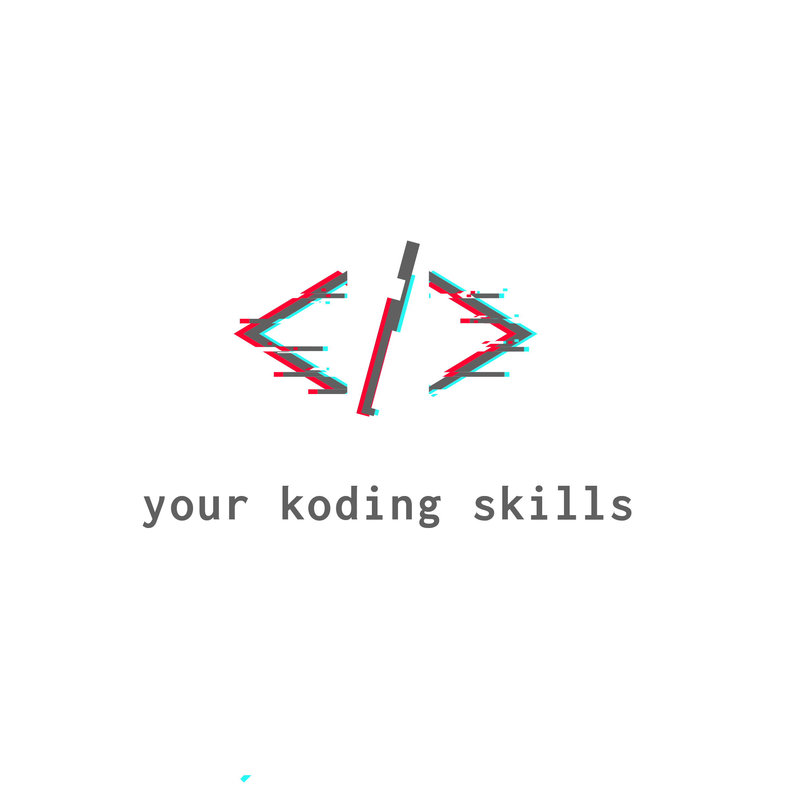

# 100Days100Projects
This repository is for public.

## Hi Friends welcome to 
### **Your Koding Skills** This challenge helps you to transform yourself from junior developer to advance developer.

<p align="center">
  <a href="#">
    
  </a>
</p>
<br />

# Channel Introduction:
This repo has video reference from the Youtube Channel : [Your Koding Skills](https://youtube.com/channel/UCykgYQcHd6YSPiCl8J1sRgQ) . Kindly visit the youtube channel.


## GettingStarted
## Dependencies
```
Read the current projects readme.md file
```
## Installing
```
Read the current projects readme.md file
```

## Executing Projects
```
Read the current projects readme.md file
```
## Help
* Youtube Channel: [Your Koding Skills](https://youtube.com/channel/)
* Telegram Group: [Your Koding Skills](https://t.me/yourkodingskills)
* Visit the Youtube channel & Telegram Channel

## Projects
### * 1: Day 1: Thermostat
### * 2: Day_2: Hamburger
### * 3: day_3: Amazon Prime Profile Page
### * 4: Day_4: Covid-19 tracker


## Author
[Naveen Kumar](https://www.linkedin.com/in/naveen-kumar-k-g-27360566/)
